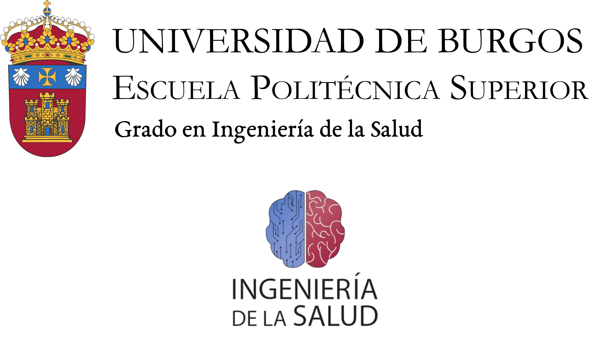

<p align="center">
  
</p>

# GammaDoc – Sistema de Gestión de Volantes PET
GammaDoc es una aplicación web desarrollada en Flask que permite a facultativos, enfermeros, técnicos y administradores gestionar volantes médicos PET, pacientes y estadísticas de forma centralizada.

## Funcionalidades principales:

- Registro y login con roles (administrador, facultativo, enfermero, técnico)
- Gestión de usuarios y aprobación de registros
- Alta y edición de pacientes
- Creación, edición y eliminación de volantes PET
- Exportación de volantes a Excel y PDF
- Bandeja de volantes con filtros avanzados
- Calendario mensual/semanal de citas
- Estadísticas gráficas de actividad
- Registro detallado de acciones de usuarios
---
## Requisitos previos
- Docker Desktop instalado y funcionando (Windows, Mac o Linux).
- WSL2 habilitado si estás en Windows.
---
## Cómo ejecutar la aplicación con Docker 

1. **Abre una terminal en la carpeta del proyecto.**

2. **Construye la imagen de Docker:**
```bash
docker build -t gammdoc-app .
```

3. **Lanza el contenedor en segundo plano:**
```bash
docker run -d -p 5000:5000 gammdoc-app
```

4. **Accede desde el navegador:**
```bash
http://localhost:5000
```

Usuario administrador inicial
Al iniciar por primera vez, se crea automáticamente un usuario administrador:

Usuario: admin
Contraseña: Admin123456.

## Cómo gestionar contenedores Docker
Para ver qué contenedores están en ejecución:
```bash
docker ps
```

Para detener un contenedor (copia el ID que aparece en la columna CONTAINER ID):
```bash
docker stop <ID_DEL_CONTENEDOR>
```

Ejemplo:
```bash
docker stop 6e2cd800073a
```